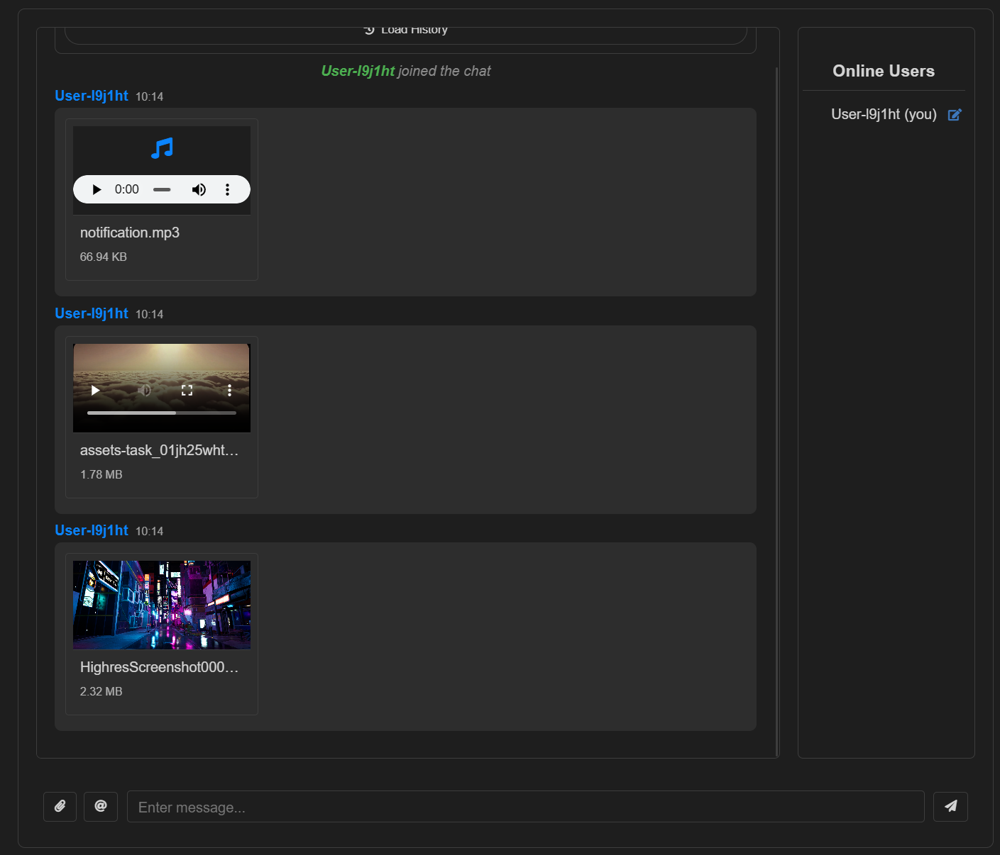
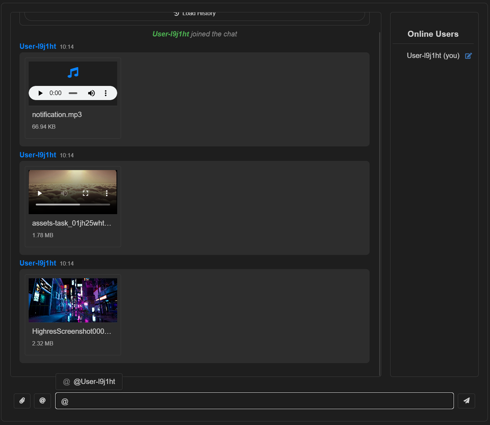
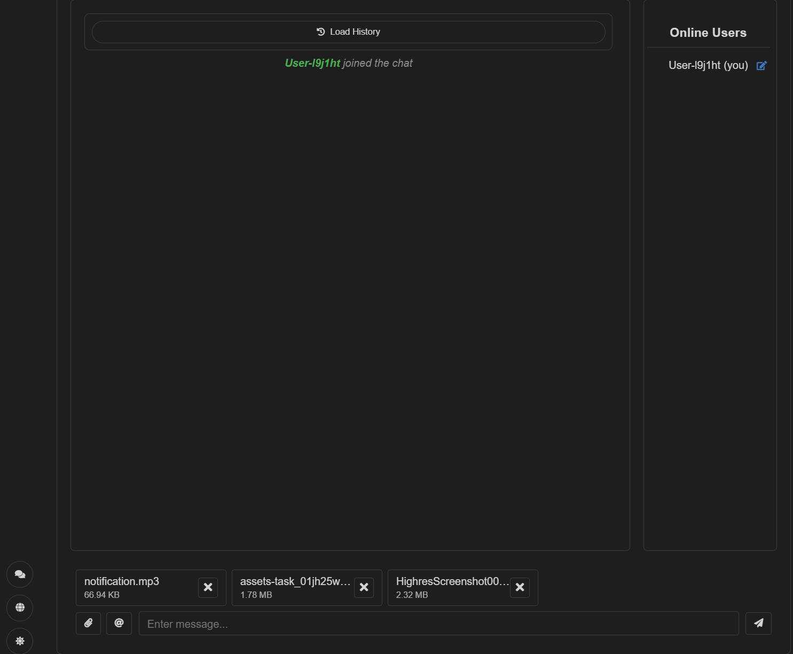

# ➤ 局域網聊天應用 (LAN Chat)
<div align="center">
<p align="center">
  <h3>
    局域網聊天應用 (LAN Chat)
  </h3>
</p>


<p align="center">

[](https://github.com/yeongpin/LanLocalChat/releases/latest)
[](https://creativecommons.org/licenses/by-nc-nd/4.0/)
[](https://github.com/yeongpin/LanLocalChat/stargazers)
[](https://github.com/yeongpin/LanLocalChat/releases/latest)

</p>
<p align="center">

</p>
</div>

## 📝 Project Introduction | 項目介紹

一個基於 Node.js 和 Vue.js 的局域網聊天應用，支持文字、圖片、視頻和文件傳輸。支持消息加密。支持Docker部署。支持nginx反向代理。

## ✨ Features | 功能特點

| Feature 功能 | Description 描述 |
|------|------|
| 💬 即時聊天 | 即時文字消息傳輸 |
| 🌐 多語言 | 支持中文和英文界面 |
| 👋 用戶提及 | 支持 @用戶名 提及通知，帶音效和桌面通知 |
| 📜 歷史消息 | 支持載入歷史聊天記錄 |
| 📷 圖片分享 | 支持 jpg、png、gif 格式 |
| 🎥 視頻分享 | 支持 mp4、webm 格式 |
| 🎵 音頻分享 | 支持 mp3、wav、ogg、m4a 格式 |
| 📄 文件傳輸 | 支持所有類型文件 |
| 👥 用戶列表 | 顯示在線用戶 |
| 📊 上傳進度 | 實時顯示文件上傳進度 |
| 😊 表情符號 | 支持發送表情 |
| 🌓 深色模式 | 支持淺色/深色主題切換 |
| 🎤 語音通話 | 支持語音通話 |

## 📂 Project Structure | 項目結構

/server - 後端服務器代碼<br>
/public - 前端 Vue.js 應用<br>
/server/uploads - 上傳文件存儲目錄<br>


## 🚀 Quick Start | 快速開始
```
git clone https://github.com/yeongpin/LanLocalChat.git
cd LanLocalChat
```

### 1️⃣ Install Dependencies | 安裝依賴
```
npm install
```


### 2️⃣ Start Server | 啟動服務器
```
npm run server
```


### 3️⃣ Start Frontend | 啟動前端
```
npm run dev
```

### 4️⃣ Modify .env file | 修改 .env 文件
請把 .env.example 複製一份，改名為 .env，並修改以下內容
```
SERVER_PORT=13050
PUBLIC_PORT=5173
HOST=0.0.0.0
PUBLIC_HOST=0.0.0.0
VITE_SERVER_PORT=13050
VITE_NAME_LIMIT=20
VITE_MESSAGE_SALT=mysecretkey123
MAX_FILE_SIZE=500
# 歷史記錄和上傳文件的保留時間 (0d0h0m0s 表示立即清理)
CLEANUP_INTERVAL=1h       # 清理檢查間隔
HISTORY_RETENTION=7d      # 歷史記錄保留時間
UPLOADS_RETENTION=1d      # 上傳文件保留時間
```

## 🌐 Deploy on Server | 部署在服務器
```
npm run build:all
```
會Build vite 到 dist 文件夾，並部署在 0.0.0.0:13050 下面，直接訪問 IP:13050 即可

如想要手動Build,請運行
```
npm run build
```
然後運行
```
npm run server
```

## 🌐 Use nginx | 使用nginx 反向代理
```
server {
    listen 80;
    server_name localhost;
    
    # 添加这一行来增加上传大小限制
    client_max_body_size 50M;

    location / {
        proxy_pass http://127.0.0.1:13050;
        proxy_set_header Host $host;
        proxy_set_header X-Real-IP $remote_addr;
        proxy_set_header X-Forwarded-For $proxy_add_x_forwarded_for;
        proxy_set_header X-Forwarded-Proto $scheme;
    }
}
```

## 🌐 Use Serv00 | 使用Serv00 部署

- 使用Serv00 部署，請手動複製 `server/server.js` 到 `domains/yourdomain.com/public_nodejs/`底下

- 更改名字為 `app.js`

- 如使用SSL , 請在 `App.vue` 的 `` const serverUrl = `http://${window.location.hostname}:${import.meta.env.VITE_SERVER_PORT || 13050}`;`` 修改為 https

- 並且在`.env` 的port 文件
```
SERVER_PORT=13050 <- 開一個port 端口為13050
VITE_SERVER_PORT=443 <- 使用SSL 的port 端口為443
```


## 🔄 Use Docker | 使用Docker 部署
```bash
# 從 GitHub Container Registry 拉取
docker run -p 13050:13050 ghcr.io/yeongpin/lanlocalchat:main

# 或從 Docker Hub 拉取
docker run -p 13050:13050 yeongpin/lanlocalchat:latest
```

## 🛠️ Tech Stack | 技術棧

| Catergory 類別 | Technology 技術 |
|------|------|
| Backend 後端 |    |
| Frontend 前端 |   |
| Tool 工具 |  |

## 📖 Usage Guide | 使用指南

### Basic Operations | 基本操作
1. Start the application | 啟動應用後，輸入您的用戶名進入聊天室
2. Click the attachment button on the left | 點擊左下角的附件按鈕可以發送文件、圖片或視頻
3. Support drag and drop to upload files | 支持拖拽上傳文件
4. The right panel displays the online user list | 右側面板顯示在線用戶列表

## ⚠️ Warning | 注意事項

- Support Image Format | 支持的圖片格式：jpg, png, gif ,webp 
- Support Video Format | 支持的視頻格式：mp4, webm , mov
- Support Audio Format | 支持的音頻格式：mp3, wav, ogg, m4a
- Support File Format | 支持的文件格式：所有類型文件

## 👥 Contributors | 貢獻者

<a href="https://github.com/yeongpin">
  
</a>

## 🎨 Preview | 預覽圖
<details>
<summary>Preview | 預覽圖</summary>
<p align="center">



</p>
</details>

## 📝 Update Log | 更新日誌

Watch [CHANGELOG | 日誌](CHANGELOG.md) for more details. | 更多詳細請查看日誌

## 📝 License | 授權

This project is licensed under the [CC BY-NC-ND 4.0](https://creativecommons.org/licenses/by-nc-nd/4.0/) License. See the [LICENSE](LICENSE) file for details.


